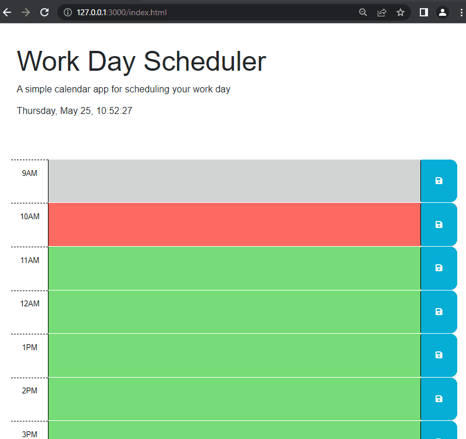

# Work Day Scheduler
### simple-cal
## Almost as simple as a paper calendar

This is a simple calendar app to track your hourly tasks. It features dynamically updated HTML and CSS powered by jQuery.

Uses [Day.js](https://day.js.org/en/) for date and time operations.

## Action shots (don't blink or you'll miss it)

## Where is it? I want it.

[here on github pages!](https://stanjosh.github.io/simple-cal/)

